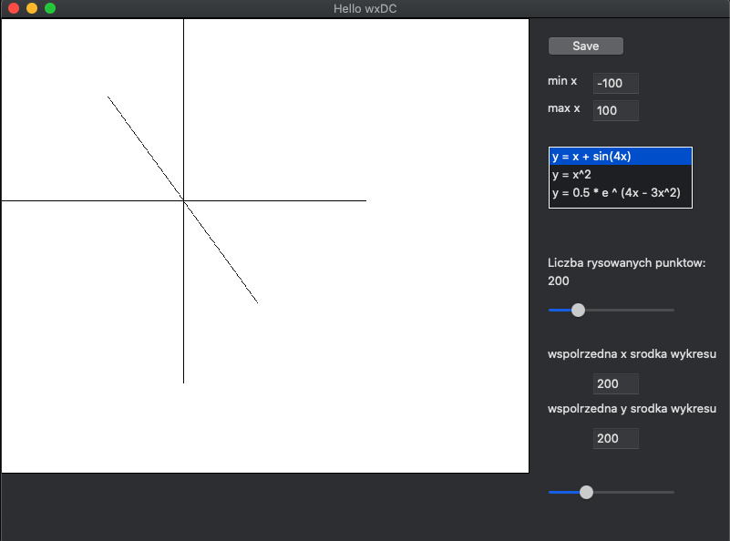

## WHAT IS IT

This repository contains project written in C++ using wxwidgets (https://www.wxwidgets.org/) library to build GUI app.

This one file cpp app has example of use:
- drawing points, lines
- drawing functions (x*x, sin(4x) etc)
- rotate transformation of point in coordinates
- translation of coordinates

## SETUP

(On macos)
- install brew (https://brew.sh/)

(in terminal):

        brew install wxwidgets

## HOW TO RUN
copy this reposytory:

    git clone https://github.com/JackDaniells121/wxWidgetsRysWykr
    cd wxWidgetsRysWykr

(terminal command to generate executable):

        c++ -o program main.cpp `wx-config --cxxflags --libs`

)